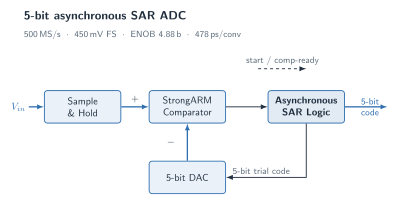

# 5-bit Asynchronous SAR ADC



A 5-bit asynchronous successive-approximation-register (SAR) ADC, designed and
verified end to end across the analog and digital domains: a StrongARM latch
comparator in Cadence (45 nm), an asynchronous SAR controller in SystemVerilog,
and independent behavioral cross-checks in **Icarus Verilog** and **ngspice**
followed by a **Yosys** gate-level synthesis.

The design targets **500 MS/s** over a **450 mV** full-scale range. Instead of a
fixed per-bit clock, the controller advances one bit at a time as soon as the
comparator reports a valid decision, so conversion time tracks comparator
resolve time.

## Highlights

| Metric | Value |
| --- | --- |
| Resolution | 5 bits |
| Sample rate | 500 MS/s |
| Full-scale range | 450 mV (LSB = 14.06 mV) |
| Comparator | StrongARM latch, 45 nm (gpdk045), ~124 ps nominal decision |
| SNDR | 31.12 dB |
| ENOB | 4.88 bits (near ideal for 5 bits) |
| Average conversion time | 477.9 ps |
| Worst-case conversion time | 512.0 ps |
| Controller synthesis | 79 cells (Yosys gate-level netlist) |

Both behavioral flows (Icarus Verilog and ngspice) agree to within **1 ps** on
conversion time and are effectively identical in SNDR/ENOB, indicating the
result is set by the SAR algorithm and the comparator timing model rather than
by a simulator-specific detail.

## Architecture

```
Vin ─▶ Sample & Hold ─▶ +┐
                         ├─▶ StrongARM Comparator ─▶ Asynchronous SAR Logic ─▶ 5-bit code
             5-bit DAC ─▶ −┘                                  │
                    ▲─────────── 5-bit trial code ────────────┘
```

- **Sample & Hold** captures the input; one conversion starts every 2 ns.
- **StrongARM comparator** resolves the trial comparison; its decision time is
  overdrive-dependent (faster for large `|Vin − VDAC|`), which is what makes the
  asynchronous sequencing meaningful.
- **Asynchronous SAR logic** asserts the MSB trial first, then keeps or clears
  each bit and immediately applies the next-lower trial bit on `comp_valid`.
- **5-bit DAC** converts the running trial code back to the comparator's
  reference input.

## Repository layout

```
async-sar-adc/
├── figures/
│   └── architecture.svg          # block diagram (above; TikZ source: architecture.tex)
├── comparator/                   # StrongARM latch design (Cadence, 45 nm)
│   ├── report.pdf
│   └── figures/                  # schematic, gm/ID sweeps, transient
└── sar-logic/                    # asynchronous SAR controller and verification
    ├── open_source_flow/         # Icarus Verilog/SystemVerilog + ENOB analysis
    ├── ngspice_experiment/       # ngspice behavioral cross-check
    ├── cadence_behavioral/       # Verilog-A behavioral models (Cadence)
    ├── synthesis_experiment/     # Yosys gate-level synthesis
    ├── figures_matlab/           # MATLAB result figures
    ├── sar_adc_async_matlab.m    # MATLAB model
    └── report.pdf                # full write-up (LaTeX source: report.tex)
```

## Verification flows

Each flow is self-contained and runnable from its own directory.

### 1. Icarus Verilog / SystemVerilog (`sar-logic/open_source_flow`)

Runs the SystemVerilog SAR controller driven by a StrongARM-inspired comparator
model, then computes SNDR/ENOB from the output codes.

```bash
cd sar-logic/open_source_flow
./run_local_flow.sh          # iverilog + vvp + analyze_enob.py
```

### 2. ngspice behavioral cross-check (`sar-logic/ngspice_experiment`)

Reproduces the same successive-approximation loop in the ngspice control
language (no Verilog-A), using the same comparator timing model.

```bash
cd sar-logic/ngspice_experiment
./run_local_flow.sh          # ngspice + analyze_ngspice.py
```

### 3. Cadence behavioral (`sar-logic/cadence_behavioral`)

Verilog-A models (`sar_logic.va`, `ideal_comp.va`, `ideal_dac.va`) and a
Spectre testbench (`run_async_sar.scs`).

### 4. Yosys gate-level synthesis (`sar-logic/synthesis_experiment`)

Synthesizes a synthesis-oriented rewrite of the SAR controller to a gate-level
netlist and renders a structural preview.

```bash
cd sar-logic/synthesis_experiment
./run_local_flow.sh          # yosys -s synth.ys
```

### Dependencies

The open-source flows require `iverilog`, `ngspice`, and `yosys` on `PATH`
(each script also falls back to a `local_tools/` package if present) and
`python3` with `numpy` and `matplotlib` for the analysis/plots.

## Comparator (StrongARM latch)

The comparator was designed in Cadence with the gpdk045 45 nm process and is the
timing source for the SAR model:

- nominal decision time ~124 ps, bounded to roughly 60–250 ps
- required minimum overdrive near 0.5 LSB

See `comparator/report.pdf` and `comparator/figures/`.

## Report

The full write-up (objective, behavioral model, cross-check tables, synthesis
results, and conclusions) is in [`sar-logic/report.pdf`](sar-logic/report.pdf).
